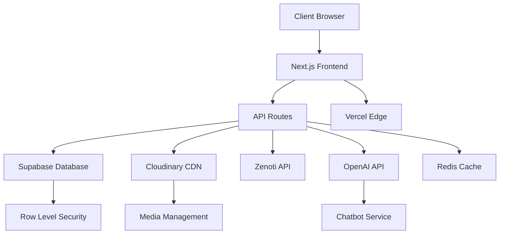
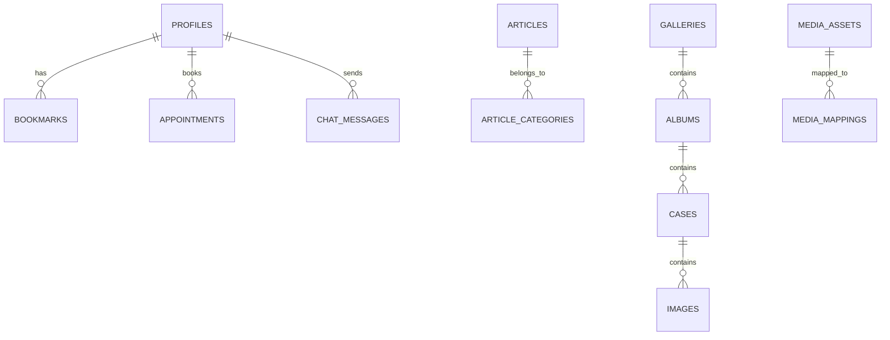
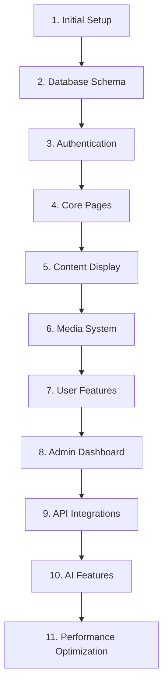
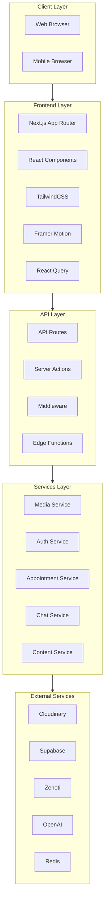
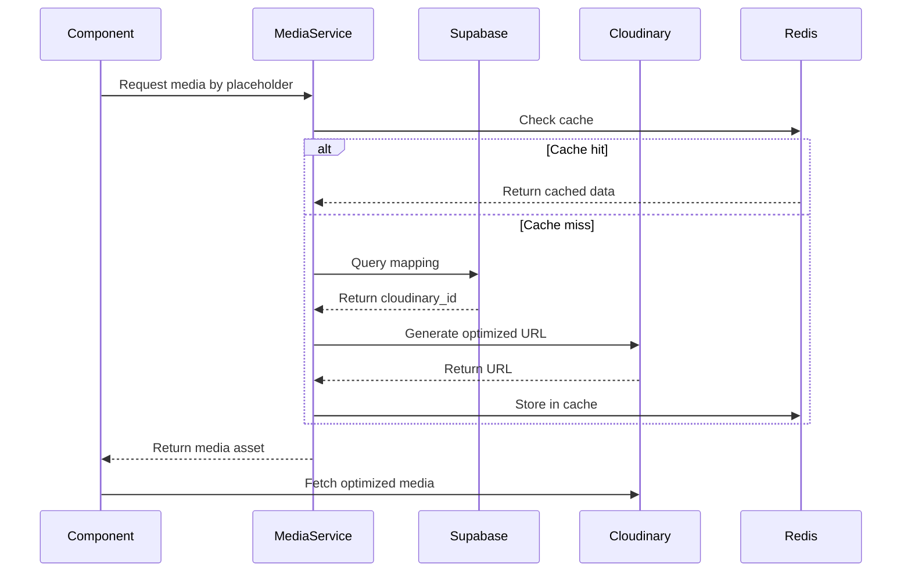

# 📚 Allure MD Next.js Web Application with Supabase & Cloudinary 

A modern, mobile-first, flat-design, SEO-optimized web application built with the latest Next.js (app router), Supabase, TailwindCSS, Framer Motion, and Cloudinary. Designed for dynamic image organization, advanced filtering, and efficient management of various medical Articles, as well as Galleries, Albums, Cases, and Images. Modern LLM trained chatbot for answering both general medical questions and specific queries pertaining to our practice and task completion, e.g., scheduling appointments. Users may create profiles where they can then schedule appointments, see appointment history, receive invitations to exclusive events and communicate via chat with providers.

## 🚀 Project Overview

### Goal
Build a web app focused on:

- Speed & Scalability
- SEO Optimization
- Seamless Mobile Experience
- Efficient Image Delivery via Cloudinary
- Metadata Management in Supabase
- A cutting-edge chatbot powered by a modern **Large Language Model (LLM)**
- Users can:
    - Read articles
    - Watch videos
    - View a gallery of images and video content
    - Bookmark content
    - Learn about the medical practice and provider details
    - Create a profile by logging in with:
        - First name
        - Last name
        - Email
        - Cell phone number
        - Password

### Key Features
- 📱 Mobile-First Design
- 🎨 Flat, Modern UI
- 📈 SEO Optimization: Includes meta tags, sitemap, and structured data.
- 📊 Dynamic Organization: Galleries → Albums → Cases → Images
- 🏷️ Tagging & Filtering System
- 🖼️ Bulk Image Uploads
- 🛡️ Admin Dashboard: Manage Galleries, Albums, Cases, and Images.
- 🚀 Fast Load Times with Cloudinary Image CDN
- Secure Auth System: Powered by Supabase Authentication.
- A cutting-edge chatbot powered by a modern **Large Language Model (LLM)**

## Feature Requirements

### Modern LLM-Trained Chatbot

#### Overview
A cutting-edge chatbot powered by a modern **Large Language Model (LLM)** designed to:
- Answer **general medical questions**.
- Handle **specific queries** related to:
  - Our practice.
  - Task completion (e.g., scheduling appointments).

#### Features
##### User Functionality
1. **Profile Creation**:
   - Users can create personalized profiles to access advanced features.

2. **Appointment Management**:
   - Schedule appointments directly through the chatbot.
   - View and manage **appointment history**.

3. **Exclusive Invitations**:
   - Receive personalized invitations to **exclusive events** hosted by our practice.

4. **Provider Communication**:
   - Chat with providers in real-time for:
     - Medical advice.
     - Updates on treatment plans.
     - General queries.

#### Benefits
- **Convenience**: Users can manage their healthcare interactions seamlessly.
- **Efficiency**: Automated scheduling and direct communication reduce wait times.
- **Personalized Experience**: Tailored responses and event invitations enhance user engagement.

This chatbot integrates modern LLM capabilities with practice-specific functionalities to provide a streamlined, user-friendly experience.


### Articles
- **Display Format**:
  - Articles are displayed in a **scrollable list format**.
  - Each article includes:
    - An image or short video at the top.
    - An engaging title.
    - A four-line brief snippet of the article.

- **Design and Layout**:
  - Article cards must match the layouts shown in:
    - `public/screenshots/header.png`
    - `public/screenshots/fonts.png`
    - `public/screenshots/home.png`
  - Fonts for titles and snippets should align with `public/screenshots/fonts.png` in terms of:
    - Font family
    - Font weight
    - Font size
  - A **consistent color palette** must be implemented.

- **Categorization**:
  - Articles are grouped into four main categories:
    - Plastic surgery
    - Dermatology
    - Medical spa
    - Functional medicine

- **Accessibility**:
  - Users can listen to articles via **text-to-speech** by clicking an audio icon.

#### Header
- **Examples**:
  - Reference `public/screenshots/header.png` for the general header design.
  - Reference `public/screenshots/header-with-section-menu-toggled.png` for the toggled navigation menu (hamburger icon).
- **Features**:
  - A **search icon** is available to open a search screen for finding articles, videos, images, and content.
  - Header design is consistent across all pages and screens.

#### Responsive Design
- **Mobile vs Desktop**:
  - On desktop:
    - Article images/videos are displayed on the right.
    - Titles and snippets are displayed on the left (split 50/50 layout).
  - On mobile:
    - Articles are presented in a vertically stacked layout.

### Gallery
- The gallery page integrates a beautiful, organized, mobile first, fast, gallery structure.
- Galleries are collections categorized by themes such as:
  - Plastic Surgery
  - Emsculpt
  - Injections
  - SylfirmX
  - Facials
- Dynamic routes include:
  - `/gallery/[id]/`: Displays a specific gallery collection.
  - `/album/[id]/`: Displays albums within a gallery collection.
  - `/case/[id]/`: Displays specific cases within an album.
- Admin features:
  - Dashboard for managing galleries, albums, and cases.
  - Upload page to add new images and content.
  - Settings page for configuration options.
  - CRUD APIs for galleries, albums, cases, and images.

### Admin Features
#### Login Screen
- Form includes:
  - Username field
  - Password field
- Buttons:
  - Submit button
  - "Forgot password" link
- Displays an error message if credentials are incorrect.
- **Successful login** redirects to the admin dashboard.

#### Dashboard
- **Tabs**:
  - Articles
  - Analytics
  - Media Library
  - Gallery
  - Marketing
  - User Data

- **Articles Tab**:
  - Displays a **grid of articles** with sorting and filtering options by:
    - Category
    - Tags
    - Keywords
  - Includes a **chat interface** for an AI content writer (reference `public/screenshots/chat-interface.png`) that allows:
    - Entering article ideas.
    - Finding relevant images or video clips.
    - Creating internal and external content links.
    - Receiving and refining article outlines.
    - Saving drafts and publishing final articles.

- **Analytics Tab**:
  - Displays detailed analytics data for the web application.

- **Media Library Tab**:
  - Provides a **grid view** of all images and videos.
  - Offers advanced search and filtering options.
  - UI is inspired by **Adobe Lightroom**.

- **Gallery Tab**:
  - Displays a **grid of collections** (e.g., plastic surgery, dermatology).
  - Each collection contains albums for individual procedure types (e.g., face, neck, ears, nose, eyelids, breast augmentation, breast lift, abdominoplasty, liposuction, etc.).
  - Each album contains **cases**, which include:
    - Cropped, side-by-side before-and-after images (typically 5 per case).
  - Allows admins to:
    - Edit, upload, delete, and manage images/videos.
    - Create and organize collections and albums.

- **Marketing Tab**:
  - Features tabs for managing:
    - Email campaigns
    - SMS campaigns
    - Social media campaigns
  - **Email Campaigns**:
    - View previous campaigns with relevant data.
    - Create, manage, and schedule new campaigns.
  - **SMS Campaigns**:
    - View previous SMS campaigns with relevant data.
    - Create, manage, and schedule new campaigns.
  - **Social Media Campaigns**:
    - Login interface for Instagram to manage content.
    - Tools include:
      - Content editor for creating/managing posts.
      - Content calendar for scheduling.
      - Insights tab for performance analytics.
  - AI chat integration:
    - Assists with content creation.
    - Provides scheduling suggestions based on analytics.

- **User Data Tab**:
  - Displays a grid of all users.
  - Allows admins to:
    - Edit, create, delete, categorize, tag, and publish user profiles.

### Standard User Features
#### Login Screen
- Form includes:
  - Username field
  - Password field
- Buttons:
  - Submit button
  - "Forgot password" link
- Displays an error message if credentials are incorrect.

#### Standard User Features
- **Login Screen**:
  - Form fields for username and password.
  - Submit button.
  - Error message displayed for incorrect credentials.
  - "Forgot password" link as a button.
- View and manage:
  - Bookmarked articles, videos, images, and content.
  - Profile page.
  - Appointment history.
- Book appointments.

### Public Access
- Public users can access:
  - Homepage articles.
  - Limited gallery videos/images.
  - Contact, About, Services, Providers, and Medical Practice pages.
  - Login, Signup, and Forgot Password pages.
- Other features/pages are restricted to logged-in users.

## Theming
- **Theme**: Modern, flat, and minimalistic.
- **Color Palette**: 
  - Shadcn/ui gray palette (see documentation at [shadcn/ui colors](https://ui.shadcn.com/colors)).
  - Refer to `public/screenshots/colors.png` for examples.
- **Typography**: Modern, flat, and minimalistic.

## 🛠️ Tech Stack

### Frontend:
- **Framework**: Next.js 14 (App Router)
- **Styling**: TailwindCSS + Radix UI Components
- **Animations**: Framer Motion
- **SEO**: Next.js Metadata API
- **Image Optimization**: Cloudinary Image Delivery via CDN
- **State Management**: React Query for data fetching and caching
- **Performance Monitoring**: Lighthouse CI integration

### Backend / Database:
- **CMS & Database**: Supabase
- **Authentication**: Supabase Auth
- **Caching Layer**: Redis for query caching
- **Chatbot Integration**: OpenAI-powered LLM chatbot for real-time communication and task automation.
- **AI Features**:
  - **AI-Based Image Tagging**: Automatically categorize and tag images in the media library for efficient management and search.
  - **AI Treatment Recommendations**: Generate personalized treatment plans for users based on profile data and medical history.
  - **AI Image Transformation**: Allow users to:
    - Upload a photo.
    - Use interactive controls to simulate potential outcomes of procedures offered by the practice.

### Deployment:
- **Platform**: Vercel
- **CDN**: Cloudinary for image delivery
- **Edge Functions**: Vercel Edge for optimized API routes
- **Analytics**: Vercel Analytics + Custom tracking

### Integration Support:
- **APIs**: RESTful APIs with Next.js API Routes
- **Custom Hooks**: Reusable hooks for data fetching
- **LLM Chatbot**: Integrated OpenAI API for handling user queries, profile management, appointment scheduling, and event invitations.
- **AI Services**: Cloud-based APIs for image tagging, treatment recommendations, and photo transformations.

## 🏗️ Technical Architecture

### System Components



### Data Models

The application uses a comprehensive data model structure:

#### Core Entities
1. **Team Members** - Healthcare providers and staff
2. **Articles** - Medical content with categories and tags
3. **Galleries/Albums/Cases/Images** - Visual content organization
4. **Profiles** - User accounts
5. **Appointments** - Scheduling system
6. **Chat Messages** - Conversational interface
7. **Media Assets** - Unified media management

#### Database Relationships


### APIs and Integrations

1. **Cloudinary API**
   - Media upload and transformation
   - Image optimization with WebP/AVIF format support
   - Video delivery with adaptive streaming
   - Automated tagging

2. **Supabase**
   - Authentication
   - Real-time database
   - Row-level security
   - File storage

3. **Zenoti API**
   - Appointment scheduling
   - Provider availability
   - Service management
   - Customer records

4. **OpenAI API**
   - Chatbot functionality
   - Content generation
   - Medical Q&A
   - Appointment assistance

## 📊 Performance Optimization Strategy

### Image Optimization
- Use WebP format with AVIF fallback for modern browsers
- Implement responsive images with srcset
- Lazy loading for below-the-fold images
- Priority loading for above-the-fold images
- Image dimensions specified to prevent layout shifts

### Caching Strategy
- Browser caching with proper cache headers
- Edge caching via Vercel Edge Network
- Redis caching for frequent database queries
- Incremental Static Regeneration (ISR) for articles:
  ```typescript
  export const revalidate = 3600; // Revalidate every hour
  ```

### State Management
```typescript
// Example with React Query
const { data: articles } = useQuery({
  queryKey: ['articles', category],
  queryFn: () => fetchArticles(category),
  staleTime: 5 * 60 * 1000, // 5 minutes
  cacheTime: 30 * 60 * 1000, // 30 minutes
});
```

### Edge Computing
- Use edge functions for API routes requiring low latency
- Geographically distributed content delivery
- Serverless functions for scalability

## 🔍 SEO Enhancement Strategy

### Technical SEO
1. **Dynamic sitemap generation**
   ```typescript
   // app/sitemap.ts
   export default async function sitemap() {
     const articles = await getArticles();
     return [
       { url: 'https://alluremd.com', lastModified: new Date() },
       ...articles.map(article => ({
         url: `https://alluremd.com/articles/${article.slug}`,
         lastModified: article.updated_at,
       })),
     ];
   }
   ```

2. **Structured data implementation**
   ```typescript
   // Article structured data example
   const articleSchema = {
     "@context": "https://schema.org",
     "@type": "Article",
     "headline": article.title,
     "datePublished": article.published_at,
     "author": {
       "@type": "Person",
       "name": article.author.name
     }
   };
   ```

3. **Meta tags and OpenGraph**
   ```typescript
   export const metadata = {
     title: 'Allure MD - Advanced Medical Treatments',
     description: 'Leading provider of plastic surgery, dermatology...',
     openGraph: {
       title: 'Allure MD',
       description: 'Advanced medical treatments and care',
       images: ['/og-image.jpg'],
     },
     twitter: {
       card: 'summary_large_image',
       title: 'Allure MD',
       description: 'Advanced medical treatments and care',
     },
   };
   ```

4. **Canonical URLs to prevent duplicate content**
   ```typescript
   <link rel="canonical" href={`https://alluremd.com${path}`} />
   ```

## 🛡️ Unified Media System

### Single Media Service Architecture
```typescript
interface MediaService {
  getAsset(placeholderId: string): Promise<MediaAsset>;
  updateMapping(placeholderId: string, mediaId: string): Promise<void>;
  generateOptimizedUrl(asset: MediaAsset, options: OptimizationOptions): string;
  getResponsiveSources(asset: MediaAsset): ResponsiveSource[];
}
```

### Media Component Structure
```typescript
// Unified media component
const UnifiedMedia = ({ 
  placeholderId,
  type = 'auto',
  alt,
  priority = false,
  sizes = '100vw',
  ...props
}: UnifiedMediaProps) => {
  const { data: asset, isLoading } = useQuery({
    queryKey: ['media', placeholderId],
    queryFn: () => mediaService.getAsset(placeholderId),
  });
  
  if (isLoading) return <MediaSkeleton />;
  
  return asset.type === 'video' ? (
    <UnifiedVideo asset={asset} {...props} />
  ) : (
    <UnifiedImage asset={asset} alt={alt} priority={priority} sizes={sizes} {...props} />
  );
};
```

## 📅 Development Roadmap

### Phase 1: Foundation (MVP)
- Basic Next.js application structure
- Supabase integration and authentication
- Homepage with hero section
- Basic article display
- Provider pages
- Contact form

### Phase 2: Content Management
- Article CMS implementation
- Image upload functionality with unified media system
- Basic gallery structure
- SEO optimization foundation
- Search functionality

### Phase 3: Media System
- Cloudinary integration with WebP/AVIF support
- Unified media management
- Responsive image optimization
- Video player implementation with adaptive streaming
- Gallery navigation

### Phase 4: User Features
- User registration and profiles
- Appointment booking system
- Personal dashboards
- Bookmark functionality
- Appointment history

### Phase 5: Admin Dashboard
- Content management interface
- Analytics integration
- Media library management
- Marketing tools
- User management

### Phase 6: Advanced Features
- LLM-powered chatbot
- AI content generation
- Email/SMS campaigns
- Social media integration
- Advanced analytics

### Phase 7: Performance Optimization
- Implement caching strategies
- Edge function deployment
- Performance monitoring
- ISR for dynamic content
- Service worker implementation

## 🔄 Logical Dependency Chain



1. **Initial Setup**: Next.js, Tailwind, basic configuration
2. **Database Schema**: Supabase tables and relationships
3. **Authentication**: User registration and login
4. **Core Pages**: Homepage, About, Services
5. **Content Display**: Articles, Gallery pages
6. **Media System**: Cloudinary integration
7. **User Features**: Profiles, Bookmarks
8. **Admin Dashboard**: CMS interface
9. **API Integrations**: Zenoti, external services
10. **AI Features**: Chatbot, content generation
11. **Performance Optimization**: Caching, edge functions

## ⚠️ Risks and Mitigations

### Technical Challenges
1. **Media Performance**
   - Risk: Large image/video files slowing down the site
   - Mitigation: Cloudinary optimization, lazy loading, CDN usage, WebP/AVIF formats

2. **Database Scalability**
   - Risk: Complex queries impacting performance
   - Mitigation: Indexed fields, query optimization, Redis caching, connection pooling

3. **Third-party API Reliability**
   - Risk: External service outages
   - Mitigation: Fallback mechanisms, retry logic, status monitoring, circuit breakers

### Resource Constraints
1. **Development Time**
   - Risk: Feature scope exceeding timeline
   - Mitigation: Phased rollout, MVP focus, agile methodology

2. **API Rate Limits**
   - Risk: Hitting service quotas
   - Mitigation: Request throttling, caching, batch operations, queue systems

### Security Concerns
1. **Data Protection**
   - Risk: Patient information exposure
   - Mitigation: Row-level security, encryption, access controls, HIPAA compliance

2. **Authentication Vulnerabilities**
   - Risk: Unauthorized access
   - Mitigation: Supabase Auth, MFA options, session management, security headers

## 📂 Project Structure

```plaintext
allure-md/
├── app/
│   ├── (admin)/                  # Admin routes group
│   │   └── admin/
│   │       ├── dashboard/
│   │       ├── login/
│   │       └── ...
│   ├── (public)/                 # Public routes group
│   │   ├── articles/
│   │   ├── gallery/
│   │   ├── services/
│   │   └── ...
│   ├── api/
│   │   ├── auth/
│   │   ├── media/
│   │   ├── articles/
│   │   └── ...
│   ├── error.tsx
│   ├── global-error.tsx
│   ├── layout.tsx
│   └── page.tsx
├── components/
│   ├── admin/
│   ├── media/
│   │   ├── UnifiedImage.tsx
│   │   ├── UnifiedVideo.tsx
│   │   └── MediaRenderer.tsx
│   ├── ui/
│   └── ...
├── lib/
│   ├── services/
│   │   ├── media-service.ts
│   │   ├── auth-service.ts
│   │   └── ...
│   ├── hooks/
│   │   ├── useMedia.ts
│   │   └── ...
│   ├── utils/
│   └── ...
├── public/
│   ├── images/
│   ├── videos/
│   └── screenshots/
├── styles/
│   └── globals.css
├── types/
│   └── index.ts
├── utils/
│   └── helpers.ts
├── .env.local
├── next.config.ts
├── package.json
├── tailwind.config.ts
└── tsconfig.json
```

## 🗂️ Database Schema

[Previous database schema section remains the same...]

## 🔑 Authentication

[Previous authentication section remains the same...]

## 🖥 Cloudinary Organization

[Previous Cloudinary organization section remains the same...]

## 🖥️ How to Set Up Locally

[Previous setup instructions remain the same...]

## 🔧 API Routes

[Previous API routes section remains the same...]

## 🛡️ Admin Dashboard

[Previous admin dashboard section remains the same...]

## 📊 SEO Checklist

- Dynamic meta tags with OpenGraph and Twitter cards
- Alt attributes for every image
- JSON-LD structured data for all content types
- Canonical URLs to prevent duplicate content
- Sitemap generation with automatic updates
- robots.txt configuration
- Performance optimization for Core Web Vitals
- Proper heading hierarchy
- Mobile-friendly responsive design
- Schema markup for medical content

## 🚀 Deployment

1. Push code to GitHub
2. Connect repository to Vercel
3. Add environment variables in Vercel Dashboard
4. Configure edge functions
5. Set up Redis caching
6. Enable Analytics
7. Deploy

## 📝 Future Enhancements

- Advanced Search Functionality with Algolia
- AI-based Image Tagging
- Role-Based Access Control
- Multi-language Support
- Progressive Web App (PWA) capabilities
- WebSocket for real-time chat
- Content versioning system
- A/B testing framework

## 🔍 Architecture Diagrams

### System Architecture


### Media System Flow


## 📚 Appendix

### Research Findings
- Medical practice websites typically see 70% mobile traffic
- Image optimization can improve load times by 40-60%
- Chatbot integration increases user engagement by 30%
- WebP format reduces image size by 25-35% compared to JPEG

### Technical Specifications
- Next.js 14+ with App Router
- Supabase PostgreSQL database
- Cloudinary for media management
- Vercel for deployment
- Tailwind CSS for styling
- OpenAI GPT-4 for chatbot
- Redis for caching
- React Query for state management

### Current Implementation Status
The project has already implemented:
- Basic authentication
- Article management
- Gallery structure
- Task management system
- Multiple media systems (needs consolidation)

### Performance Targets
- First Contentful Paint (FCP): < 1.8s
- Largest Contentful Paint (LCP): < 2.5s
- Cumulative Layout Shift (CLS): < 0.1
- First Input Delay (FID): < 100ms
- Time to Interactive (TTI): < 3.8s

### Monitoring and Analytics
- Vercel Analytics for performance monitoring
- Custom event tracking for user interactions
- Error tracking with Sentry
- Real User Monitoring (RUM)
- Google Analytics 4 integration

