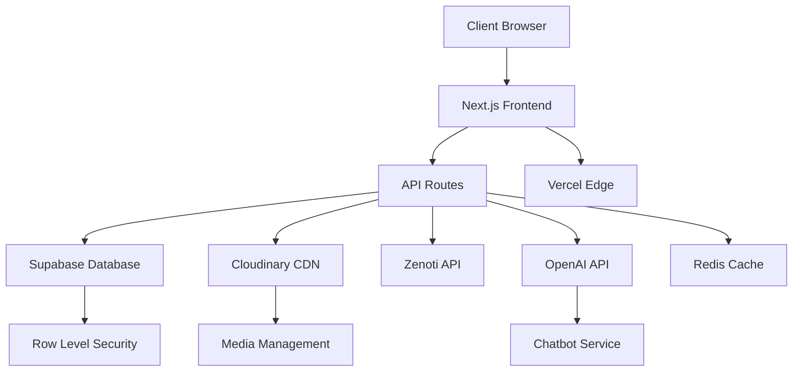

# System Patterns: Allure MD Web Application

## System Architecture

The Allure MD web application follows a modern web architecture with the following key components:



## Key Technical Decisions

1. **Next.js App Router**: Utilizing the App Router for improved routing, server components, and SEO capabilities.
2. **Supabase for Database and Auth**: Leveraging Supabase for PostgreSQL database, authentication, and row-level security.
3. **Cloudinary for Media**: Implementing Cloudinary integration for optimized image and video delivery.
4. **TailwindCSS with shadcn/ui**: Using TailwindCSS with shadcn/ui components for consistent styling.
5. **React Query for Data Fetching**: Implementing React Query for efficient data fetching, caching, and state management.
6. **Vercel for Deployment**: Hosting on Vercel for edge functions and optimal performance.
7. **OpenAI Integration**: Using OpenAI for the LLM-trained chatbot functionality.

## Design Patterns

1. **Server Components**: Leveraging Next.js server components for improved performance and SEO.
2. **Client Components**: Using client components where interactivity is required.
3. **Repository Pattern**: Implementing service classes for data access.
4. **Component Composition**: Building complex UIs from composable, reusable components.
5. **Optimistic Updates**: Using React Query for optimistic UI updates.
6. **Progressive Enhancement**: Ensuring core functionality works without JavaScript.
7. **Responsive Design**: Mobile-first approach with adaptive layouts.

## Component Relationships

### Frontend Structure
- **Layouts**: Define the overall structure for different sections
- **Page Components**: Implement specific route functionality
- **UI Components**: Reusable interface elements
- **Media Components**: Specialized components for Cloudinary integration
- **Form Components**: Handle user inputs with validation

### Backend Structure
- **API Routes**: Handle server-side logic and data access
- **Service Classes**: Abstract database operations
- **Middleware**: Handle authentication and authorization
- **Edge Functions**: Optimize performance for specific operations

### Data Flow
1. **Server-Side Rendering**: Fetch data on the server for initial page load
2. **Client-Side Updates**: Use React Query for subsequent data fetching
3. **Real-time Updates**: Utilize Supabase subscriptions for live data where needed
4. **Caching**: Implement Redis caching for frequent database queries

## Gallery Structure
A hierarchical organization system:
```
Galleries → Albums → Cases → Images
```

- **Galleries**: Top-level categories (e.g., Plastic Surgery, Dermatology)
- **Albums**: Procedure types within categories (e.g., Face, Breast)
- **Cases**: Individual patient cases with before/after results
- **Images**: Individual images within a case

## Media System Implementation
- Direct use of Cloudinary public IDs
- Leverage of next-cloudinary components
- Server-side optimization
- Responsive image implementation

## Standardized Approaches
1. **Authentication Flow**: Consistent authentication across public/private routes
2. **Error Handling**: Standardized error components with clear messaging
3. **Loading States**: Consistent loading indicators for improved UX
4. **Form Validation**: Client and server-side validation with clear error messages
5. **API Responses**: Standardized response format across all endpoints 