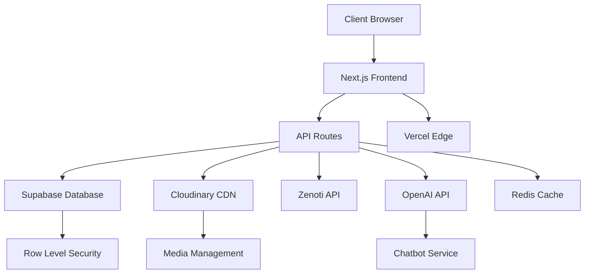

# System Patterns: Allure MD Web Application

## System Architecture

The Allure MD web application follows a modern web architecture with the following key components:



## Key Technical Decisions

1. **Next.js App Router**: Utilizing the App Router for improved routing, server components, and SEO capabilities.
2. **Supabase for Database and Auth**: Leveraging Supabase for PostgreSQL database, authentication, and row-level security.
3. **Cloudinary for Media**: Implementing Cloudinary integration for optimized image and video delivery.
4. **TailwindCSS with shadcn/ui**: Using TailwindCSS with shadcn/ui components for consistent styling.
5. **React Query for Data Fetching**: Implementing React Query for efficient data fetching, caching, and state management.
6. **Vercel for Deployment**: Hosting on Vercel for edge functions and optimal performance.
7. **OpenAI Integration**: Using OpenAI for the LLM-trained chatbot functionality.

## Design Patterns

1. **Server Components**: Leveraging Next.js server components for improved performance and SEO.
2. **Client Components**: Using client components where interactivity is required.
3. **Repository Pattern**: Implementing service classes for data access.
4. **Component Composition**: Building complex UIs from composable, reusable components.
5. **Optimistic Updates**: Using React Query for optimistic UI updates.
6. **Progressive Enhancement**: Ensuring core functionality works without JavaScript.
7. **Responsive Design**: Mobile-first approach with adaptive layouts.

## Component Relationships

### Frontend Structure
- **Layouts**: Define the overall structure for different sections
- **Page Components**: Implement specific route functionality
- **UI Components**: Reusable interface elements
- **Media Components**: Specialized components for Cloudinary integration
- **Form Components**: Handle user inputs with validation

### Backend Structure
- **API Routes**: Handle server-side logic and data access
- **Service Classes**: Abstract database operations
- **Middleware**: Handle authentication and authorization
- **Edge Functions**: Optimize performance for specific operations

### Data Flow
1. **Server-Side Rendering**: Fetch data on the server for initial page load
2. **Client-Side Updates**: Use React Query for subsequent data fetching
3. **Real-time Updates**: Utilize Supabase subscriptions for live data where needed
4. **Caching**: Implement Redis caching for frequent database queries

## Gallery Structure
A hierarchical organization system:
```
Galleries → Albums → Cases → Images
```

- **Galleries**: Top-level categories (e.g., Plastic Surgery, Dermatology)
- **Albums**: Procedure types within categories (e.g., Face, Breast)
- **Cases**: Individual patient cases with before/after results
- **Images**: Individual images within a case

## Media Handling System

We've implemented a Cloudinary-based media system that leverages Cloudinary's advanced image and video optimization capabilities:

### Cloudinary Integration

1. **CldImage Component**: Primary component for rendering optimized images:
```jsx
<CldImage
  publicId="folder/image-name"
  alt="Image description"
  width={800}
  height={600}
  crop="fill"
  gravity="auto"
  quality="auto"
/>
```

2. **CldVideo Component**: Handles video rendering with optimizations:
```jsx
<CldVideo
  publicId="folder/video-name"
  width={800}
  height={450}
  autoPlay
  muted
  loop
/>
```

3. **Adapter Pattern**: We use adapter components to handle different media sources:
   - `MediaAdapter`: Adapts between Cloudinary and regular media sources
   - `MediaRenderer`: Renders media based on mediaType

4. **API Layer**: Media placeholderIds are mapped to Cloudinary publicIds through API endpoints:
```
/api/media/[placeholderId] → { publicId: "cloudinary/path/image" }
```

### Migration Pattern

Components use a conditional rendering pattern to handle the transition:
```jsx
{publicId ? (
  <CldImage publicId={publicId} {...props} />
) : (
  <Image src="/fallback.jpg" {...props} />
)}
```

### Benefits

- Automatic responsive images
- Advanced transformations (crop, resize, quality)
- Format optimization (WebP, AVIF)
- Lazy loading and progressive loading
- Integration with Next.js image optimization

This approach consolidates our previous fragmented media handling into a streamlined system that leverages Cloudinary's CDN and optimization capabilities.

## Standardized Approaches
1. **Authentication Flow**: Consistent authentication across public/private routes
2. **Error Handling**: Standardized error components with clear messaging
3. **Loading States**: Consistent loading indicators for improved UX
4. **Form Validation**: Client and server-side validation with clear error messages
5. **API Responses**: Standardized response format across all endpoints 

## SEO Architecture Patterns

### Hybrid Rendering Strategy

We use a contextual rendering approach based on content type:

1. **Static Generation (SSG)** for core pages that don't change frequently:
   - Homepage
   - About pages
   - Core procedure descriptions
   - Physician profiles
   - Contact information

2. **Incremental Static Regeneration (ISR)** for content that updates periodically:
   - Blog posts
   - Testimonials
   - Before/after galleries

3. **Server-Side Rendering (SSR)** for personalized or frequently changing content:
   - Search results
   - Filtered galleries
   - Appointment availability

### SEO Component Architecture

1. **Metadata Component Pattern**
```tsx
// app/procedures/[slug]/page.tsx
import { notFound } from 'next/navigation'
import { Metadata } from 'next'
import { getProcedureBySlug } from '@/lib/procedures'

export async function generateMetadata(
  { params }: { params: { slug: string } }
): Promise<Metadata> {
  const procedure = await getProcedureBySlug(params.slug)
  if (!procedure) return notFound()
  
  return {
    title: `${procedure.title} | Allure MD`,
    description: procedure.metaDescription,
    openGraph: {
      title: procedure.title,
      description: procedure.metaDescription,
      images: [procedure.featuredImage],
    },
  }
}
```

2. **Schema.org Structured Data Pattern**
```tsx
// components/StructuredData.tsx
import { Procedure } from '@/types/procedures'

export function ProcedureSchema({ procedure }: { procedure: Procedure }) {
  const schema = {
    '@context': 'https://schema.org',
    '@type': 'MedicalProcedure',
    name: procedure.title,
    description: procedure.description,
    // ...additional fields
  }
  
  return (
    <script 
      type="application/ld+json"
      dangerouslySetInnerHTML={{ __html: JSON.stringify(schema) }}
    />
  )
}
```

## Unified Media System

We've implemented a consolidated media handling system using a single `UnifiedMedia` component that provides a consistent interface for all image and video content.

### Media Component Architecture

1. **UnifiedMedia Component**: The core component that handles all media rendering:

```tsx
<UnifiedMedia
  placeholderId="home-hero"
  alt="Welcome to Allure MD"
  width={1200}
  height={600}
  priority
/>
```

2. **Media Source Resolution Flow**:
```
placeholderId → API lookup → Media Asset → Cloudinary URL → Rendered Component
```

3. **Backwards Compatibility Layer**:
   The `MediaAdapter` component provides adapters for all previous media components, ensuring backward compatibility while transitioning to the unified approach.

4. **Error Handling Pattern**:
   All media components use a standardized error handling pattern with:
   - Loading state visualization using Skeletons
   - Fallback images when media fails to load
   - Consistent error reporting to the console
   - Retry mechanism for failed images

5. **Three-Tier Media Identification**:
   The system supports three ways to identify media:
   - `placeholderId`: For content mapped in the registry or database
   - `publicId`: For direct Cloudinary asset references
   - `src`: For direct URL references

This approach consolidates multiple overlapping components (UnifiedImage, CloudinaryImage, MediaImage, etc.) into a single, flexible component with standardized props and behavior.

## Database Patterns

### Supabase Row Level Security

We implement robust security using Supabase Row Level Security (RLS) policies:

```sql
-- Example policy for protected tables
CREATE POLICY "Allow authenticated read access"
ON public.protected_table
FOR SELECT
TO authenticated
USING (true);
```

### Efficient Query Patterns

We use the following patterns for database access:

1. **Optimistic Updates**: UI updates immediately while changes are sent to the database

2. **Pagination with Cursors**: For efficient listing of large datasets

3. **Join Aggregation**: When querying related data across tables:

```typescript
const { data } = await supabase
  .from('gallery')
  .select(`
    id,
    name,
    description,
    albums (
      id,
      title,
      description,
      cases (count)
    )
  `)
```

## Authentication Patterns

### Auth Flow

1. **Auth Modal**: Consistent login/signup UI across site
2. **JWT with Refresh Tokens**: For secure authentication 
3. **Role-Based Access Control**: Admin vs regular user capabilities

## Client-Side Patterns

### Form Handling

We use a consistent pattern for forms with Zod validation:

```tsx
const formSchema = z.object({
  name: z.string().min(2).max(50),
  email: z.string().email(),
  message: z.string().min(10),
})

export function ContactForm() {
  const form = useForm<z.infer<typeof formSchema>>({
    resolver: zodResolver(formSchema),
    defaultValues: {
      name: '',
      email: '',
      message: '',
    },
  })
  
  // Form implementation
}
```

### Data Fetching

Server components use direct Supabase queries, while client components use SWR for data fetching:

```tsx
// Client component data fetching
const { data, error, isLoading } = useSWR(
  `/api/articles?category=${category}`,
  fetcher
);
```