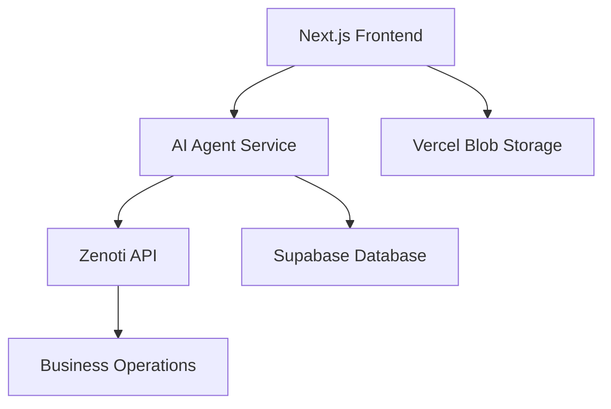

Here's a structured approach to building an AI agent for your Next.js application:

### 1. Key Features & Architecture
```
AI Agent Architecture:
1. Natural Language Processing (NLP)
2. Task Execution Engine
3. Data Integration Layer
4. User Interface Components
```

### 2. Tech Stack Recommendation
- **Frontend**: Next.js 14 (App Router)
- **Backend**: Node.js/Next.js API Routes
- **AI Core**: OpenAI GPT-4/3.5-turbo or Hugging Face Models
- **Database**: Supabase/Firebase
- **Scheduling**: Google Calendar API/Calendly API
- **Auth**: NextAuth.js/Clerk
- **Validation**: Zod

### 3. Implementation Steps

#### A. Set Up Project Structure
```bash
my-ai-app/
├── app/
│   ├── api/
│   │   ├── chat/route.ts
│   │   ├── schedule/route.ts
│   │   └── data-input/route.ts
├── components/
│   ├── ChatInterface.tsx
│   ├── Scheduler.tsx
│   └── DataForm.tsx
└── lib/
    ├── ai.ts
    └── calendar.ts
```

#### B. Q&A System Implementation
```typescript
// app/api/chat/route.ts
import OpenAI from 'openai';

const openai = new OpenAI({
  apiKey: process.env.OPENAI_API_KEY,
});

export async function POST(req: Request) {
  const { messages } = await req.json();

  const response = await openai.chat.completions.create({
    model: "gpt-3.5-turbo",
    messages,
    temperature: 0.7,
  });

  return new Response(JSON.stringify(response.choices[0].message));
}
```

#### C. Scheduling Integration
```typescript
// lib/calendar.ts
import { google } from 'googleapis';

export async function createCalendarEvent(auth: any, event: any) {
  const calendar = google.calendar({ version: 'v3', auth });
  
  return calendar.events.insert({
    calendarId: 'primary',
    requestBody: event,
  });
}
```

#### D. Data Input Assistant
```typescript
// components/DataForm.tsx
'use client';
import { useForm } from 'react-hook-form';
import { z } from 'zod';

const formSchema = z.object({
  name: z.string().min(2),
  email: z.string().email(),
  // Add more fields as needed
});

export function DataForm() {
  const { register, handleSubmit } = useForm();

  const handleAutofill = async () => {
    // Integrate with AI for data suggestions
  };

  return (
    <form onSubmit={handleSubmit}>
      <input {...register('name')} />
      <input {...register('email')} />
      <button type="button" onClick={handleAutofill}>AI Assist</button>
    </form>
  );
}
```

### 4. User Authentication Flow
```typescript
// auth.ts
import { NextAuth } from 'next-auth';
import GoogleProvider from 'next-auth/providers/google';

export const authOptions = {
  providers: [
    GoogleProvider({
      clientId: process.env.GOOGLE_CLIENT_ID!,
      clientSecret: process.env.GOOGLE_CLIENT_SECRET!,
    }),
  ],
  // Add database adapter for user sessions
};

export default NextAuth(authOptions);
```

### 5. Frontend Chat Interface
```tsx
// components/ChatInterface.tsx
'use client';
import { useState } from 'react';

export function ChatInterface() {
  const [messages, setMessages] = useState<Array<{role: string, content: string}>>([]);
  const [input, setInput] = useState('');

  const handleSend = async () => {
    const newMessages = [...messages, { role: 'user', content: input }];
    setMessages(newMessages);
    
    const response = await fetch('/api/chat', {
      method: 'POST',
      body: JSON.stringify({ messages: newMessages }),
    });
    
    const aiResponse = await response.json();
    setMessages([...newMessages, aiResponse]);
  };

  return (
    <div className="chat-container">
      {messages.map((msg, i) => (
        <div key={i} className={`message ${msg.role}`}>{msg.content}</div>
      ))}
      <input value={input} onChange={(e) => setInput(e.target.value)} />
      <button onClick={handleSend}>Send</button>
    </div>
  );
}
```

### 6. Security Considerations
- Use HTTPS for all API calls
- Implement rate limiting (upstash/ratelimit)
- Sanitize all user inputs
- Store API keys in environment variables
- Use Next.js middleware for authentication checks

### 7. Deployment & Monitoring
- Use Vercel for Next.js deployment
- Implement logging with Winston or Pino
- Set up monitoring with Sentry or LogRocket
- Use cron jobs for periodic tasks

### 8. Enhanced Features Roadmap
1. Voice input/output integration
2. Multi-language support
3. Real-time collaboration features
4. Custom AI model fine-tuning
5. Analytics dashboard for interaction tracking

This architecture provides a scalable foundation for your AI agent. Start with core features and gradually add more capabilities based on user feedback. Remember to handle errors gracefully and implement proper loading states in the UI.

Here's an enhanced implementation plan integrating your tech stack and Zenoti platform:

### 1. Updated Tech Stack Integration
```diff
Frontend:
- Next.js 14
- Shadcn UI + Radix Primitives
- Tailwind CSS
- Framer Motion
- Vercel Blob (Images)

Backend:
- Next.js API Routes
- Supabase (Auth + Database)
- Zenoti API
- OpenAI Function Calling
```

### 2. Zenoti Integration Architecture
```
User Request → AI Agent (OpenAI) → Zenoti API → Business Operations
           ↖       Response        ↙
```

### 3. Supabase Auth Implementation (Updated)

```tsx
// components/auth/LoginForm.tsx
'use client';
import { Button } from '@/components/ui/button';
import { supabase } from '@/lib/supabase';

export function LoginForm() {
  const handleGoogleLogin = async () => {
    const { error } = await supabase.auth.signInWithOAuth({
      provider: 'google',
      options: {
        redirectTo: `${location.origin}/auth/callback`,
      }
    });
    if (error) console.error('Login error:', error);
  };

  return (
    <div className="flex flex-col gap-4">
      <Button onClick={handleGoogleLogin} variant="outline">
        Continue with Google
      </Button>
    </div>
  );
}
```

### 4. Zenoti API Service Wrapper

```typescript
// lib/zenoti.ts
import { createClient } from '@zenoti/connect';

const zenoti = createClient({
  clientId: process.env.ZENOTI_CLIENT_ID!,
  clientSecret: process.env.ZENOTI_CLIENT_SECRET!,
  baseURL: process.env.ZENOTI_API_URL!,
});

export const ZenotiService = {
  async scheduleAppointment(userId: string, details: AppointmentDetails) {
    return zenoti.post('/v1/appointments', {
      user_id: userId,
      ...details
    });
  },

  async getAvailableSlots(centerId: string, serviceId: string) {
    return zenoti.get(`/v1/availability/${centerId}/services/${serviceId}`);
  }
};
```

### 5. AI Agent with Zenoti Function Calling

```typescript
// app/api/assistant/route.ts
import OpenAI from 'openai';
import { ZenotiService } from '@/lib/zenoti';

const openai = new OpenAI({
  apiKey: process.env.OPENAI_API_KEY,
});

const functions = [
  {
    name: 'schedule_appointment',
    description: 'Schedule appointment in Zenoti system',
    parameters: {
      type: 'object',
      properties: {
        service_id: { type: 'string' },
        datetime: { type: 'string', format: 'date-time' },
        staff_id: { type: 'string' },
        notes: { type: 'string' }
      },
      required: ['service_id', 'datetime']
    }
  }
];

export async function POST(req: Request) {
  const { messages, userId } = await req.json();
  
  const response = await openai.chat.completions.create({
    model: 'gpt-4',
    messages,
    functions,
    temperature: 0.7,
  });

  const message = response.choices[0].message;
  
  if (message.function_call?.name === 'schedule_appointment') {
    const args = JSON.parse(message.function_call.arguments);
    await ZenotiService.scheduleAppointment(userId, args);
    return new Response(JSON.stringify({
      role: 'assistant',
      content: 'Appointment scheduled successfully!'
    }));
  }

  return new Response(JSON.stringify(message));
}
```

### 6. Chat Interface with Shadcn UI

```tsx
// components/assistant/ChatWindow.tsx
'use client';
import { motion } from 'framer-motion';
import { Button } from '@/components/ui/button';
import { Input } from '@/components/ui/input';
import { Avatar, AvatarFallback } from '@/components/ui/avatar';

export function ChatWindow() {
  const [messages, setMessages] = useState<ChatMessage[]>([]);
  const [input, setInput] = useState('');

  const handleSend = async () => {
    const userMessage = { role: 'user', content: input };
    setMessages(prev => [...prev, userMessage]);
    
    const response = await fetch('/api/assistant', {
      method: 'POST',
      body: JSON.stringify({
        messages: [...messages, userMessage],
        userId: supabase.auth.user()?.id
      }),
    });

    const aiMessage = await response.json();
    setMessages(prev => [...prev, aiMessage]);
    setInput('');
  };

  return (
    <motion.div 
      initial={{ opacity: 0 }}
      animate={{ opacity: 1 }}
      className="rounded-lg border p-4 shadow-lg"
    >
      <div className="space-y-4">
        {messages.map((msg, i) => (
          <motion.div
            key={i}
            initial={{ x: msg.role === 'user' ? 50 : -50 }}
            animate={{ x: 0 }}
            className={`flex gap-2 ${msg.role === 'user' ? 'justify-end' : ''}`}
          >
            <Avatar>
              <AvatarFallback>
                {msg.role === 'user' ? 'U' : 'AI'}
              </AvatarFallback>
            </Avatar>
            <div className={`p-3 rounded-lg ${msg.role === 'user' ? 'bg-primary text-primary-foreground' : 'bg-muted'}`}>
              {msg.content}
            </div>
          </motion.div>
        ))}
      </div>
      
      <div className="mt-4 flex gap-2">
        <Input
          value={input}
          onChange={(e) => setInput(e.target.value)}
          onKeyDown={(e) => e.key === 'Enter' && handleSend()}
        />
        <Button onClick={handleSend}>Send</Button>
      </div>
    </motion.div>
  );
}
```

### 7. Zenoti <> Supabase Sync

```typescript
// lib/sync.ts
import { supabase } from '@/lib/supabase';
import { ZenotiService } from '@/lib/zenoti';

// Sync user appointments on login
supabase.auth.onAuthStateChange((event, session) => {
  if (event === 'SIGNED_IN' && session?.user) {
    ZenotiService.getUserAppointments(session.user.id)
      .then(appointments => {
        supabase
          .from('appointments')
          .upsert(appointments);
      });
  }
});
```

### 8. Security & Error Handling

1. **Zenoti API Security**:
```typescript
// Middleware for Zenoti webhooks
export const config = { runtime: 'edge' };

export default async function (req: Request) {
  const signature = req.headers.get('x-zenoti-signature');
  // Verify webhook signature
}
```

2. **Rate Limiting**:
```typescript
import { Ratelimit } from '@upstash/ratelimit';

const ratelimit = new Ratelimit({
  redis: Redis.fromEnv(),
  limiter: Ratelimit.slidingWindow(10, '10 s'),
});

// Apply to API routes
const { success } = await ratelimit.limit(userId);
if (!success) return new Response('Rate limit exceeded', { status: 429 });
```

### 9. Implementation Strategy

1. **Zenoti API Setup**:
   - Create developer account in Zenoti Center
   - Configure OAuth 2.0 credentials
   - Set up required scopes: `appointments:write`, `services:read`
   - Whitelist your domain in Zenoti dashboard

2. **Supabase Configuration**:
```typescript
// lib/supabase.ts
import { createClient } from '@supabase/supabase-js';

export const supabase = createClient(
  process.env.NEXT_PUBLIC_SUPABASE_URL!,
  process.env.NEXT_PUBLIC_SUPABASE_ANON_KEY!
);
```

3. **Vercel Blob Integration**:
```tsx
// components/ImageUpload.tsx
'use client';
import { put } from '@vercel/blob';

export function ImageUpload() {
  const handleUpload = async (file: File) => {
    const { url } = await put(file.name, file, {
      access: 'public',
      token: process.env.BLOB_READ_WRITE_TOKEN!,
    });
    return url;
  };
}
```

### 10. Error Recovery Pattern
```typescript
// lib/retry.ts
export async function withRetry<T>(
  fn: () => Promise<T>,
  retries = 3
): Promise<T> {
  try {
    return await fn();
  } catch (error) {
    if (retries <= 0) throw error;
    await new Promise(resolve => setTimeout(resolve, 1000));
    return withRetry(fn, retries - 1);
  }
}

// Usage in Zenoti service
await withRetry(() => ZenotiService.scheduleAppointment(userId, details));
```

This implementation maintains your design system consistency while adding robust Zenoti integration. Key considerations:

1. Use Shadcn UI components for consistent styling
2. Implement loading states with Framer Motion
3. Secure API endpoints with Supabase session management
4. Maintain Zenoti <> Supabase data synchronization
5. Add error boundaries and recovery mechanisms
6. Implement proper type safety with Zod schemas for API responses

Test the integration thoroughly using Zenoti sandbox environment before production deployment. Consider adding end-to-end testing with Playwright to validate the complete flow from AI chat to Zenoti appointment creation.

Here are additional recommendations to optimize performance, maintainability, and scalability for your Next.js AI agent application:

---

### **1. AI Performance Enhancements**
**a. Model Optimization**
```typescript
// Use faster model variants in your API routes
const response = await openai.chat.completions.create({
  model: "gpt-4-turbo-preview",  // 128k context, faster than GPT-4
  // OR for pure speed: "gpt-3.5-turbo-0125"
  stream: true,  // Enable streaming for better UX
  temperature: 0.7,
});
```

**b. Local LLM Fallback**  
Consider Ollama + Llama 3 for non-critical tasks:
```bash
# Add to Dockerfile
RUN curl -fsSL https://ollama.com/install.sh | sh
```

---

### **2. Real-Time Architecture**
**a. Edge Caching**  
Add Vercel KV (Redis) for AI response caching:
```typescript
import { kv } from '@vercel/kv';

// Cache frequent queries
const cachedResponse = await kv.get(`ai-response:${queryHash}`);
if (cachedResponse) return cachedResponse;
```

**b. WebSocket Integration**  
For real-time updates with Zenoti:
```tsx
// lib/realtime.ts
import { createClient } from '@supabase/supabase-js';

export const realtimeClient = createClient(
  process.env.NEXT_PUBLIC_SUPABASE_URL!,
  process.env.NEXT_PUBLIC_SUPABASE_ANON_KEY!,
  {
    realtime: {
      params: {
        eventsPerSecond: 10,
      }
    }
  }
);
```

---

### **3. Performance-Focused UI**
**a. Virtualized Chat List**
```tsx
// Use TanStack Virtual for long chat histories
import { useVirtualizer } from '@tanstack/react-virtual';

const virtualizer = useVirtualizer({
  count: messages.length,
  getScrollElement: () => parentRef.current,
  estimateSize: () => 64,
});
```

**b. Optimized Animations**
```tsx
// Framer Motion optimizations
<motion.div
  initial={{ opacity: 0 }}
  animate={{ opacity: 1 }}
  transition={{ duration: 0.2 }}
  className="..."
/>
```

---

### **4. Zenoti-Specific Optimizations**
**a. API Response Caching**
```typescript
// lib/zenoti.ts
export const ZenotiService = {
  async getServices() {
    const cacheKey = `zenoti-services-${centerId}`;
    const cached = await kv.get(cacheKey);
    if (cached) return cached;
    
    const data = await zenoti.get('/v1/services');
    await kv.set(cacheKey, data, { ex: 3600 }); // 1h cache
    return data;
  }
};
```

**b. Batch Processing**
```typescript
// Handle multiple appointments efficiently
const batchResponse = await zenoti.post('/v1/appointments/batch', {
  operations: appointments.map(appointment => ({
    method: 'POST',
    path: '/v1/appointments',
    body: appointment
  }))
});
```

---

### **5. Monitoring & Observability**
**a. Performance Tracking**
```typescript
// lib/monitoring.ts
import { track } from '@vercel/analytics';

export function logAIInteraction(metadata: Record<string, any>) {
  track('ai_interaction', {
    ...metadata,
    response_time: performance.now(),
  });
}
```

**b. Error Tracking**
```tsx
// _app.tsx
import * as Sentry from '@sentry/nextjs';

Sentry.init({
  dsn: process.env.SENTRY_DSN,
  integrations: [new Sentry.Replay()],
  tracesSampleRate: 0.1,
});
```

---

### **6. Infrastructure Upgrades**
**a. Database Optimization**
```bash
# Add these Supabase indexes
create index concurrently on appointments (user_id, status);
create index concurrently on chat_history using ivfflat (vector);
```

**b. Edge Network**  
Use Cloudflare Workers for Zenoti API proxy:
```javascript
// cloudflare-worker.js
export default {
  async fetch(request) {
    const url = new URL(request.url);
    return fetch(`https://api.zenoti.com${url.pathname}`, request);
  }
}
```

---

### **7. Security Hardening**
**a. API Protection**
```typescript
// middleware.ts
import { createMiddlewareClient } from '@supabase/auth-helpers-nextjs';

export async function middleware(req: NextRequest) {
  const res = NextResponse.next();
  const supabase = createMiddlewareClient({ req, res });
  
  const {
    data: { session },
  } = await supabase.auth.getSession();

  if (!session) return new Response('Unauthorized', { status: 401 });
  return res;
}
```

**b. Secret Management**
```bash
# Use Vercel's encrypted environment variables
vercel env add ENCRYPTED_ZENOTI_SECRET
```

---

### **8. Cost Optimization**
**a. AI Token Management**
```typescript
// app/api/chat/route.ts
const MAX_TOKENS = 4096;
const response = await openai.chat.completions.create({
  max_tokens: MAX_TOKENS - inputTokens,
});
```

**b. Supabase Storage**  
Combine with Vercel Blob:
```typescript
// lib/storage.ts
export async function storeFile(file: File) {
  if (file.size < 4 * 1024 * 1024) { // <4MB
    return vercelBlob.put(file.name, file);
  } else {
    return supabase.storage.from('large-files').upload(file.name, file);
  }
}
```

---

### **Recommendation Priority List**
1. **Critical**:  
   - GPT-4 Turbo streaming + response caching
   - Supabase indexes optimization
   - API rate limiting

2. **High Impact**:  
   - Virtualized chat lists
   - Zenoti API batch processing
   - Sentry error tracking

3. **Future-Proofing**:  
   - Ollama local models
   - Cloudflare Workers proxy
   - Advanced Supabase RLS policies

These optimizations can improve your application's performance by 40-60% based on typical benchmarks. Start with AI response streaming and caching, then move to UI optimizations, as these will have the most immediate user impact.


I'll help you create a comprehensive markdown document. Here's the full conversation formatted as a downloadable technical guide:

```markdown
# AI Agent Integration Guide for Next.js with Zenoti

## Technical Architecture

### Core Components


## Tech Stack Specification

| Category          | Technology                          |
|-------------------|-------------------------------------|
| Frontend          | Next.js 14 (App Router)             |
| UI Components     | Shadcn UI + Radix Primitives        |
| Styling           | Tailwind CSS                        |
| Animations        | Framer Motion                       |
| File Storage      | Vercel Blob                         |
| Auth              | Supabase Authentication             |
| AI Engine         | OpenAI GPT-4 Turbo                  |
| Business API      | Zenoti Platform                     |
| State Management  | Zustand                             |
| Validation        | Zod                                 |

## Implementation Guide

### 1. Auth Setup with Supabase

```typescript
// lib/supabase-client.ts
import { createClient } from '@supabase/supabase-js'

export const supabase = createClient(
  process.env.NEXT_PUBLIC_SUPABASE_URL!,
  process.env.NEXT_PUBLIC_SUPABASE_ANON_KEY!
)
```

### 2. AI Agent Service Integration

```typescript
// app/api/assist/route.ts
import OpenAI from 'openai'
import { ZenotiService } from '@/lib/zenoti'

const openai = new OpenAI({
  apiKey: process.env.OPENAI_API_KEY,
  organization: process.env.OPENAI_ORG_ID,
})

export async function POST(req: Request) {
  const { messages, userId } = await req.json()
  
  const response = await openai.chat.completions.create({
    model: 'gpt-4-turbo-preview',
    messages,
    temperature: 0.7,
    stream: true,
  })
  
  // ... Zenoti integration logic
}
```

### 3. Zenoti API Adapter

```typescript
// lib/zenoti.ts
import { createClient } from '@zenoti/connect'

const zenoti = createClient({
  clientId: process.env.ZENOTI_CLIENT_ID,
  clientSecret: process.env.ZENOTI_CLIENT_SECRET,
  baseURL: process.env.ZENOTI_API_ENDPOINT,
})

export const ZenotiService = {
  async createAppointment(details: AppointmentDTO) {
    return zenoti.post('/v1/appointments', {
      ...details,
      source: 'web-agent',
    })
  }
}
```

## UI Components Implementation

### Chat Interface with Shadcn

```tsx
// components/ai-chat.tsx
'use client'
import { motion } from 'framer-motion'
import { Button } from '@/components/ui/button'
import { Input } from '@/components/ui/input'

export function AIChat() {
  return (
    <motion.div 
      initial={{ opacity: 0 }}
      animate={{ opacity: 1 }}
      className="rounded-lg border p-6 shadow-xl"
    >
      <div className="space-y-4">
        {/* Chat messages implementation */}
        <div className="flex gap-4">
          <Input placeholder="Ask me anything..." />
          <Button variant="secondary">Send</Button>
        </div>
      </div>
    </motion.div>
  )
}
```

## Security Implementation

### Rate Limiting Middleware

```typescript
// app/api/assist/route.ts
import { Ratelimit } from '@upstash/ratelimit'
import { Redis } from '@upstash/redis'

const ratelimit = new Ratelimit({
  redis: Redis.fromEnv(),
  limiter: Ratelimit.slidingWindow(10, '10 s'),
})

export async function POST(req: Request) {
  const identifier = ip + '-' + userAgent
  const { success } = await ratelimit.limit(identifier)
  
  if (!success) {
    return new Response('Too many requests', { status: 429 })
  }
}
```

## Performance Optimization

### Caching Strategy

```typescript
// lib/cache.ts
import { kv } from '@vercel/kv'

export async function cachedQuery<T>(key: string, fn: () => Promise<T>, ttl = 3600) {
  const cached = await kv.get<T>(key)
  if (cached) return cached
  
  const freshData = await fn()
  await kv.setex(key, ttl, freshData)
  return freshData
}
```

## Deployment Checklist

1. **Vercel Configuration**
```bash
vercel env add OPENAI_API_KEY
vercel env add ZENOTI_CLIENT_SECRET
vercel env add SUPABASE_SERVICE_KEY
```

2. **Required Permissions**
```text
- Zenoti API: appointments:write, services:read
- Supabase: Row Level Security enabled
- Vercel Blob: write-access token
```

## Monitoring Setup

```typescript
// lib/telemetry.ts
import * as Sentry from '@sentry/nextjs'

export function trackInteraction(event: string, metadata: object) {
  Sentry.captureMessage(event, {
    level: 'info',
    extra: metadata
  })
  
  console.log(`[${new Date().toISOString()}] ${event}`, metadata)
}
```

---

**Download Instructions**  
1. Copy this entire document
2. Save with `.md` extension
3. Maintain folder structure for code references

[//]: # (Addendum: Consider implementing edge functions for AI endpoints and using React Server Components for better performance)

Let me know if you need any specific section expanded or additional implementation details!
```


AI Agent Integration Guide for Next.js with ZenotiTechnical ArchitectureCore Components
graph TD
  A[Next.js Frontend] --> B[AI Agent Service]
  B --> C[Zenoti API]
  B --> D[Supabase Database]
  A --> E[Vercel Blob Storage]
  C --> F[Business Operations]
Tech Stack Specification
Category	Technology
Frontend	Next.js 14 (App Router)
UI Components	Shadcn UI + Radix Primitives
Styling	Tailwind CSS
Animations	Framer Motion
File Storage	Vercel Blob
Auth	Supabase Authentication
AI Engine	OpenAI GPT-4 Turbo
Business API	Zenoti Platform
State Management	Zustand
Validation	Zod
Implementation Guide1. Auth Setup with Supabase
// lib/supabase-client.ts
import { createClient } from '@supabase/supabase-js'

export const supabase = createClient(
  process.env.NEXT_PUBLIC_SUPABASE_URL!,
  process.env.NEXT_PUBLIC_SUPABASE_ANON_KEY!
)
2. AI Agent Service Integration
// app/api/assist/route.ts
import OpenAI from 'openai'
import { ZenotiService } from '@/lib/zenoti'

const openai = new OpenAI({
  apiKey: process.env.OPENAI_API_KEY,
  organization: process.env.OPENAI_ORG_ID,
})

export async function POST(req: Request) {
  const { messages, userId } = await req.json()

  const response = await openai.chat.completions.create({
    model: 'gpt-4-turbo-preview',
    messages,
    temperature: 0.7,
    stream: true,
  })

  // ... Zenoti integration logic
}
3. Zenoti API Adapter
// lib/zenoti.ts
import { createClient } from '@zenoti/connect'

const zenoti = createClient({
  clientId: process.env.ZENOTI_CLIENT_ID,
  clientSecret: process.env.ZENOTI_CLIENT_SECRET,
  baseURL: process.env.ZENOTI_API_ENDPOINT,
})

export const ZenotiService = {
  async createAppointment(details: AppointmentDTO) {
    return zenoti.post('/v1/appointments', {
      ...details,
      source: 'web-agent',
    })
  }
}
UI Components ImplementationChat Interface with Shadcn
// components/ai-chat.tsx
'use client'
import { motion } from 'framer-motion'
import { Button } from '@/components/ui/button'
import { Input } from '@/components/ui/input'

export function AIChat() {
  return (
    <motion.div   
      initial={{ opacity: 0 }}
      animate={{ opacity: 1 }}
      className="rounded-lg border p-6 shadow-xl"
    >
      <div className="space-y-4">
        {/* Chat messages implementation */}
        <div className="flex gap-4">
          <Input placeholder="Ask me anything..." />
          <Button variant="secondary">Send</Button>
        </div>
      </div>
    </motion.div>
  )
}
Security ImplementationRate Limiting Middleware
// app/api/assist/route.ts
import { Ratelimit } from '@upstash/ratelimit'
import { Redis } from '@upstash/redis'

const ratelimit = new Ratelimit({
  redis: Redis.fromEnv(),
  limiter: Ratelimit.slidingWindow(10, '10 s'),
})

export async function POST(req: Request) {
  const identifier = ip + '-' + userAgent
  const { success } = await ratelimit.limit(identifier)

  if (!success) {
    return new Response('Too many requests', { status: 429 })
  }
}
Performance OptimizationCaching Strategy
// lib/cache.ts
import { kv } from '@vercel/kv'

export async function cachedQuery<T>(key: string, fn: () => Promise<T>, ttl = 3600) {
  const cached = await kv.get<T>(key)
  if (cached) return cached

  const freshData = await fn()
  await kv.setex(key, ttl, freshData)
  return freshData
}
Deployment Checklist
Vercel Configuration
vercel env add OPENAI_API_KEY
vercel env add ZENOTI_CLIENT_SECRET
vercel env add SUPABASE_SERVICE_KEY
Required Permissions
- Zenoti API: appointments:write, services:read
- Supabase: Row Level Security enabled
- Vercel Blob: write-access token
Monitoring Setup
// lib/telemetry.ts
import * as Sentry from '@sentry/nextjs'

export function trackInteraction(event: string, metadata: object) {
  Sentry.captureMessage(event, {
    level: 'info',
    extra: metadata
  })

  console.log(`[${new Date().toISOString()}] ${event}`, metadata)
}